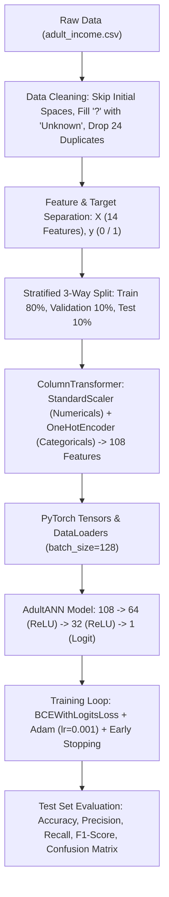

# 📘 Artificial Neural Networks (ANN) — Complete Implementation & Practice Notes

---

## 📌 Executive Summary

This document provides a comprehensive technical reference for two Artificial Neural Network implementations:
1. **NumPy Implementation From Scratch (`ANN_scratch.py`)**: A fundamental 2-layer ANN built using pure Python and NumPy to demystify matrix math, forward propagation, manual backpropagation, chain rule calculus, and gradient descent.
2. **Production PyTorch Real-Dataset Implementation (`Real_dataset_implementation.ipynb`)**: A professional, end-to-end deep learning pipeline on tabular data ([adult_income.csv](adult_income.csv)) featuring scikit-learn preprocessing, stratified 3-way data splitting, PyTorch `DataLoader` batching, Early Stopping, and complete evaluation metrics.

---

## 🧠 Part 1: ANN From Scratch using NumPy (`ANN_scratch.py`)

### 1.1 Overview & Problem Domain
- **File:** [ANN_scratch.py](ANN_scratch.py)
- **Objective:** Train a 2-layer Neural Network from scratch without deep learning frameworks to solve the non-linearly separable **XOR Logic Gate**.
- **Architecture:** 
  - **Input Layer:** 2 nodes ($x_1, x_2$)
  - **Hidden Layer:** 4 neurons with Sigmoid activation
  - **Output Layer:** 1 neuron with Sigmoid activation

---

### 1.2 Mathematical Foundations & Formulas

#### **1. Forward Propagation**
- **Layer 1 (Hidden Layer):**
  $$\mathbf{Z}_1 = \mathbf{X} \mathbf{W}_1 + \mathbf{b}_1, \quad \mathbf{A}_1 = \sigma(\mathbf{Z}_1)$$
- **Layer 2 (Output Layer):**
  $$\mathbf{Z}_2 = \mathbf{A}_1 \mathbf{W}_2 + \mathbf{b}_2, \quad \mathbf{A}_2 = \sigma(\mathbf{Z}_2)$$

#### **2. Activation Function (Sigmoid)**
$$\sigma(z) = \frac{1}{1 + e^{-z}}$$
- **Derivative of Sigmoid in terms of activation $a = \sigma(z)$:**
  $$\sigma'(z) = a (1 - a)$$

#### **3. Loss Function (Mean Squared Error)**
$$L(y, \hat{y}) = \frac{1}{N} \sum_{i=1}^{N} (\hat{y}_i - y_i)^2$$
- **Derivative with respect to Output Activation $\mathbf{A}_2$:**
  $$\frac{\partial L}{\partial \mathbf{A}_2} = \frac{2}{N} (\mathbf{A}_2 - y)$$

#### **4. Backpropagation & Chain Rule Derivations**

* **Output Layer (Layer 2) Gradients:**
  $$\delta_2 = \frac{\partial L}{\partial \mathbf{Z}_2} = \frac{\partial L}{\partial \mathbf{A}_2} \odot \sigma'(\mathbf{Z}_2) = \frac{2}{N} (\mathbf{A}_2 - y) \odot \mathbf{A}_2 (1 - \mathbf{A}_2)$$
  $$\nabla_{\mathbf{W}_2} L = \mathbf{A}_1^T \delta_2, \quad \nabla_{\mathbf{b}_2} L = \sum_{\text{rows}} \delta_2$$

* **Hidden Layer (Layer 1) Gradients:**
  $$\delta_1 = \frac{\partial L}{\partial \mathbf{Z}_1} = (\delta_2 \mathbf{W}_2^T) \odot \sigma'(\mathbf{A}_1) = (\delta_2 \mathbf{W}_2^T) \odot \mathbf{A}_1 (1 - \mathbf{A}_1)$$
  $$\nabla_{\mathbf{W}_1} L = \mathbf{X}^T \delta_1, \quad \nabla_{\mathbf{b}_1} L = \sum_{\text{rows}} \delta_1$$

#### **5. Parameter Updates (Gradient Descent)**
$$\mathbf{W}_2 \leftarrow \mathbf{W}_2 - \alpha \nabla_{\mathbf{W}_2} L, \quad \mathbf{b}_2 \leftarrow \mathbf{b}_2 - \alpha \nabla_{\mathbf{b}_2} L$$
$$\mathbf{W}_1 \leftarrow \mathbf{W}_1 - \alpha \nabla_{\mathbf{W}_1} L, \quad \mathbf{b}_1 \leftarrow \mathbf{b}_1 - \alpha \nabla_{\mathbf{b}_1} L$$
*(where $\alpha$ is the learning rate)*.

---

### 1.3 Code Structure & Implementation Details (`ANN_scratch.py`)

| Method / Variable | Description & Formula |
| :--- | :--- |
| `__init__(input_size, hidden_size, output_size, learning_rate)` | Randomly initializes weights $\mathbf{W}_1, \mathbf{W}_2$ using Gaussian distribution (`np.random.randn`) and biases $\mathbf{b}_1, \mathbf{b}_2$ to zeros. |
| `sigmoid(x)` | Implements $\frac{1}{1 + e^{-x}}$. |
| `sigmoid_derivative(output)` | Computes $\text{output} \times (1 - \text{output})$. |
| `mse_loss(y_true, y_pred)` | Computes Mean Squared Error $\text{np.mean}((y - \hat{y})^2)$. |
| `mse_loss_derivative(y_true, y_pred)` | Computes $\frac{2}{N}(\hat{y} - y)$. |
| `forward(X)` | Performs matrix multiplication and activation through hidden and output layers. |
| `backward(X, y)` | Computes gradients via chain rule and updates weights/biases using gradient descent. |
| `training_loop(X, y, epochs)` | Runs training for specified epochs (e.g. 5,000 epochs) and prints loss every 500 steps. |
| `predict(X)` | Applies 0.5 threshold (`np.round`) to predicted probabilities to yield binary 0/1 outputs. |

#### **Execution Results on XOR Gate:**
```text
Epoch    0 | Loss = 0.347522
Epoch 1000 | Loss = 0.088241
Epoch 2000 | Loss = 0.007681
Epoch 3000 | Loss = 0.002824
Epoch 4000 | Loss = 0.001642

Predictions:
[[0.]
 [1.]
 [1.]
 [0.]]
```

---

## 🚀 Part 2: Real-World PyTorch ANN Implementation (`Real_dataset_implementation.ipynb`)

### 2.1 Overview & Dataset Specifications
- **File:** [Real_dataset_implementation.ipynb](Real_dataset_implementation.ipynb)
- **Dataset:** [adult_income.csv](adult_income.csv) (32,561 rows, 15 columns).
- **Goal:** Binary classification predicting whether an individual earns `>50K` (Class 1) or `<=50K` (Class 0).

---

### 2.2 Step-by-Step Pipeline Architecture



---

### 2.3 Key Implementation Steps

#### **1. Data Cleaning & Missing Value Imputation**
- **Whitespace Handling:** `pd.read_csv(..., skipinitialspace=True)` removes spaces following commas.
- **Duplicate Removal:** Removed 24 duplicate records (`df.drop_duplicates()`), preserving 32,537 unique rows.
- **Missing Value Handling:** Missing values (`'?'`) in `workclass` (1,836), `occupation` (1,843), and `native-country` (582) were filled with `'Unknown'`, creating explicit indicator categories during encoding.

#### **2. Stratified 3-Way Data Partitioning**
To ensure unbiased evaluation and prevent data leakage:
- **Train Set (80%):** 26,029 samples
- **Validation Set (10%):** 3,254 samples
- **Test Set (10%):** 3,254 samples
- `stratify=y` maintains the ~75.9% / ~24.1% target class distribution across all splits.

#### **3. Preprocessing via ColumnTransformer**
- **Numerical Features (6 cols):** `age`, `fnlwgt`, `education-num`, `capital-gain`, `capital-loss`, `hours-per-week` $\rightarrow$ Standardized via `StandardScaler()`.
- **Categorical Features (8 cols):** `workclass`, `education`, `marital-status`, `occupation`, `relationship`, `race`, `sex`, `native-country` $\rightarrow$ One-Hot encoded via `OneHotEncoder(sparse_output=False, handle_unknown='ignore')`.
- **Expanded Dimension:** 14 raw columns expand to **108 dense features**.
- **Data Leakage Prevention:** `fit_transform` performed exclusively on `X_train`, while `transform` is applied to `X_val` and `X_test`.

#### **4. PyTorch Model Architecture (`AdultANN`)**
```python
class AdultANN(nn.Module):
    def __init__(self, input_size):
        super().__init__()
        self.fc1 = nn.Linear(input_size, 64)  # 108 -> 64
        self.fc2 = nn.Linear(64, 32)          # 64 -> 32
        self.fc3 = nn.Linear(32, 1)           # 32 -> 1 (Raw Output Logit)
        self.relu = nn.ReLU()

    def forward(self, x):
        x = self.relu(self.fc1(x))
        x = self.relu(self.fc2(x))
        return self.fc3(x)
```

#### **5. Loss Function, Optimizer & Early Stopping**
- **Loss Function:** `nn.BCEWithLogitsLoss()` (combines Sigmoid and Binary Cross Entropy in a numerically stable way).
- **Optimizer:** `torch.optim.Adam(model.parameters(), lr=0.001)`.
- **Early Stopping:** Tracks `avg_val_loss` with `patience=5`. Automatically clones and restores the best state dict `{k: v.clone() for k, v in model.state_dict().items()}` upon training completion.

---

### 2.4 Final Model Performance & Results

```text
Final Test Results:
- Accuracy:  86.57%
- Precision: 74.20%
- Recall:    67.86%
- F1-Score:  0.7089

Confusion Matrix:
[[2285  185]
 [ 252  532]]
```

---

## 📊 Part 3: Comprehensive Comparison & Key Insights

### 3.1 NumPy Scratch vs. PyTorch Framework Comparison

| Dimension | NumPy Implementation (`ANN_scratch.py`) | PyTorch Implementation (`Real_dataset_implementation.ipynb`) |
| :--- | :--- | :--- |
| **Primary Goal** | Fundamental Understanding of Math & Derivatives | Scalable Production Deep Learning Pipeline |
| **Gradient Computation** | Manual Calculus (Chain Rule Matrix Operations) | Automatic Differentiation Engine (`autograd`) |
| **Activation Functions** | Manual Sigmoid & Sigmoid Derivative | PyTorch Built-in `nn.ReLU()`, `torch.sigmoid()` |
| **Loss Functions** | Manual Mean Squared Error (MSE) | Numerically Stable `nn.BCEWithLogitsLoss()` |
| **Optimizer** | Vanilla Gradient Descent ($\mathbf{W} \leftarrow \mathbf{W} - \alpha \nabla_{\mathbf{W}} L$) | Adaptive Moment Estimation (`torch.optim.Adam`) |
| **Data Pipelines** | Raw NumPy Matrices | Scikit-learn `ColumnTransformer` + PyTorch `DataLoader` |
| **Evaluation Metrics** | Manual MSE & Binary Accuracy | Scikit-learn Accuracy, Precision, Recall, F1, Confusion Matrix |
| **Hardware Execution** | Single-threaded CPU | Seamless CPU / CUDA GPU Switching (`.to(device)`) |

---

### 3.2 Summary of Key Data Insights

1. **Class Imbalance Management:**
   - The Adult Income dataset exhibits a **~75.9% (`<=50K`) vs ~24.1% (`>50K`)** imbalance.
   - High accuracy (86.57%) alone is not enough; evaluating **Precision (74.20%)**, **Recall (67.86%)**, and **F1-Score (0.7089)** is essential to verify that high earners are accurately detected.
2. **Preprocessing Impact:**
   - Standard scaling numerical variables and one-hot encoding categoricals expanded input features from **14 to 108**, enabling linear layers to learn smooth non-linear boundaries.
3. **Generalization & Early Stopping:**
   - The training loss steadily decreased from `0.3891` to `0.2813`, while validation loss stabilized near `0.3050`. Early stopping effectively prevented overfitting and restored optimal weights.
