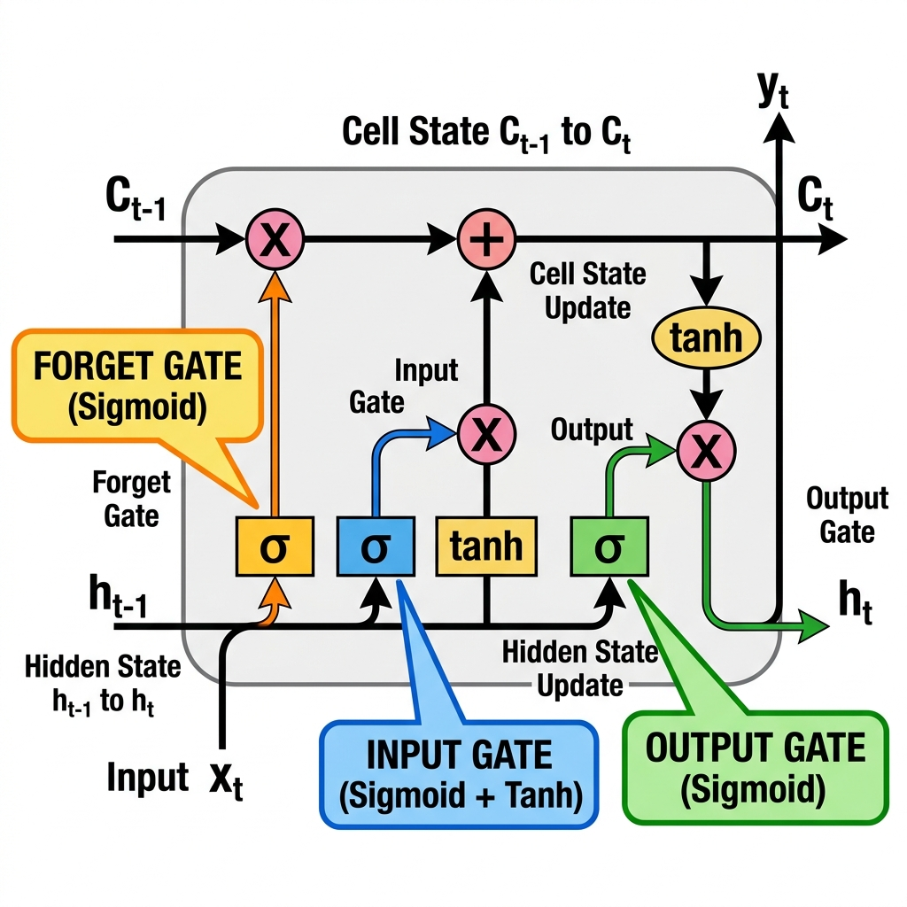

# 04. Long Short-Term Memory (LSTM) Networks: The Complete Beginner's Guide

Standard Recurrent Neural Networks (RNNs) suffer from **short-term memory loss** due to the **Vanishing Gradient Problem**—they forget information from earlier time steps when processing long sequences. 

To solve this, Sepp Hochreiter and Jürgen Schmidhuber (1997) invented **Long Short-Term Memory (LSTM)** networks. This note provides an intuitive, step-by-step breakdown of how LSTMs work, complete with circuit diagrams, mathematical formulas, and a concrete worked example.

---

## 1. Why LSTM? (The Notebook Analogy)

### The Problem with Standard RNNs
A standard RNN is like trying to memorize a 500-page book purely in your head. As new words arrive, old information gets overwritten and blurred. By the time you reach page 50, you've forgotten what happened on page 1.

### The LSTM Solution (The Smart Notebook)
An LSTM is like carrying a **Smart Notebook** (the **Cell State**) alongside your mental memory (the **Hidden State**). 

As you read through a story, you perform 3 operations on your notebook:
1. **Eraser (Forget Gate):** Erase facts that are no longer relevant (e.g., a character dies or a sentence topic changes).
2. **Pen (Input Gate):** Write down important new facts (e.g., a new character is introduced).
3. **Highlighter (Output Gate):** Highlight specific facts from your notebook to answer the current question.

```
Standard RNN:    [ Shaky Mental Memory ] (Overwritten every step)
LSTM Architecture: [ Long-Term Cell State ] + [ Short-Term Hidden State ] + [ 3 Smart Control Gates ]
```

---

## 2. The Core Architecture: Two Tracks and Three Gates

An LSTM cell manages two separate memory tracks at every time step $t$:

```
┌───────────────────────────────┬────────────────────────────────────────────────────────┐
│ Track                         │ Purpose                                                │
├───────────────────────────────┼────────────────────────────────────────────────────────┤
│ 1. Cell State (C_t)           │ The "Long-Term Memory Conveyor Belt". Flows straight   │
│                               │ through the sequence with minimal linear interactions. │
│ 2. Hidden State (h_t)         │ The "Short-Term Working Memory". Represents the output │
│                               │ and prediction at time step t.                         │
└───────────────────────────────┴────────────────────────────────────────────────────────┘
```

### The 3 Control Gates (The Regulators)
All gates use a **Sigmoid ($\sigma$)** activation function, which outputs values strictly between **0 and 1**:
* **0** = "Close the gate completely" (Block / Forget everything).
* **1** = "Open the gate completely" (Pass / Remember everything).

```
   Forget Gate (f_t) ──► Decides what to ERASE from Cell State C_{t-1}
   Input Gate  (i_t) ──► Decides what new information to WRITE into Cell State C_t
   Output Gate (o_t) ──► Decides what part of Cell State C_t to READ into Hidden State h_t
```

---

## 3. Complete Circuit Diagram of an LSTM Cell

Here is the high-resolution architectural diagram of a single LSTM cell processing time step $t$:



---

### Internal ASCII Circuit Flow:

Here is the corresponding internal circuit layout showing exact signal routing:

```
==================================================================================================
                                    LSTM CELL CIRCUIT DIAGRAM
==================================================================================================

          Cell State (Long-Term Memory Track)
  C_{t-1} ───────────────────► ( × ) ──────────────────────────────► ( + ) ──────────────────────► C_t
                                 ▲                                    ▲
                                 │                                    │
                       Forget    │                          Input     │
                       Factor    │                          Update    │
                         f_t     │                            i_t     │ Candidate C̃_t
                                 │                                    │   │
                               ┌─┴─┐                                ┌─┴─┐ └─────┐
                               │ σ │                                │ σ │       │
                               └─▲─┐                                └─▲─┘     ┌─┴─┐
                                 │ │                                  │       │tanh│
                                 │ └──────────────┬───────────────────┼───────└─▲─┘
                                 │                │                   │         │
                                 │                │                   │         │
                                 │                │                   │         │
                                 │                │                 ┌─┴─┐       │
                                 │                │                 │ σ │       │
                                 │                │                 └─▲─┘       │
                                 │                │                   │ (Output │
                                 │                │                   │  Gate)  │
                                 │                │                   │         │
  h_{t-1} ──┐                    │                │                   │         ▼
            ├──► Concatenate ────┴────────────────┴───────────────────┴──────► ( × ) ────────────► h_t
    x_t   ──┘     [h_{t-1}, x_t]                                                 ▲
                                                                                │
                                                                             tanh(C_t)

==================================================================================================
  LEGEND:
  [ σ ]    = Sigmoid Layer (Output range [0, 1])     ( × ) = Element-wise Multiplication
  [tanh]   = Tanh Layer    (Output range [-1, +1])    ( + ) = Element-wise Addition
==================================================================================================
```

---

### 🎯 Gate Identification & Component Map (Where Each Gate Lives in the Circuit):

```
┌──────────────────────────────┬───────────────────────────────┬────────────────────────────────────────────────────────┐
│ Gate / Component             │ Location in Circuit Diagram   │ Exact Connection & Function in Circuit                 │
├──────────────────────────────┼───────────────────────────────┼────────────────────────────────────────────────────────┤
│ 1. FORGET GATE (f_t)         │ 1st [ σ ] box on the LEFT     │ Connects upward to the 1st (×) node on top Cell Line.  │
│                              │                               │ Multiplies old memory C_{t-1} by f_t.                  │
│                              │                               │                                                        │
│ 2. INPUT GATE (i_t)          │ 2nd [ σ ] box in MIDDLE       │ Multiplies with Candidate C̃_t and feeds upward into    │
│                              │                               │ the 2nd (+) node on top Cell Line to update C_t.       │
│                              │                               │                                                        │
│ 3. CANDIDATE MEMORY (C̃_t)    │ 3rd [ tanh ] box in MIDDLE    │ Creates new candidate memory values. Multiplied by i_t │
│                              │                               │ before adding to the top Cell Line (+).                │
│                              │                               │                                                        │
│ 4. OUTPUT GATE (o_t)         │ 4th [ σ ] box on the RIGHT    │ Connects to the bottom-right (×) node. Multiplies      │
│                              │                               │ o_t by tanh(C_t) to generate Hidden State h_t.         │
│                              │                               │                                                        │
│ 5. CELL STATE HIGHWAY        │ TOP horizontal line           │ C_{t-1} ──► ( × ) ──► ( + ) ──► C_t                    │
│                              │ (Conveyor Belt)               │ Minimal linear operations allow unimpeded gradient flow│
└──────────────────────────────┴───────────────────────────────┴────────────────────────────────────────────────────────┘
```

---

## 4. The 4 Steps of LSTM: Equations & Symbol Breakdown

Let's break down the 4 mathematical steps executing inside an LSTM cell.

---

### Step 1: The Forget Gate ($f_t$) — Deciding What to Erase

The Forget Gate inspects the previous hidden state ($h_{t-1}$) and current input ($x_t$), outputting a number between `0` and `1` for each number in the Cell State $C_{t-1}$.

#### Equation:
$$f_t = \sigma\left( W_f \cdot [h_{t-1}, x_t] + b_f \right)$$

#### Symbol Breakdown Table:

| Symbol | Meaning | Range / Dimension |
| :--- | :--- | :--- |
| **$f_t$** | Forget gate vector (fraction of old memory to keep) | $[0.0, 1.0]$ |
| **$\sigma$** | Sigmoid activation function $\frac{1}{1 + e^{-z}}$ | Squashes to $(0, 1)$ |
| **$W_f$** | Weight matrix for the Forget Gate | $[d_h, (d_h + d_x)]$ |
| **$h_{t-1}$** | Previous hidden state vector (short-term memory) | $[d_h, 1]$ |
| **$x_t$** | Current input vector at time step $t$ | $[d_x, 1]$ |
| **$[h_{t-1}, x_t]$** | Concatenation of previous hidden state and current input | $[(d_h + d_x), 1]$ |
| **$b_f$** | Bias vector for the Forget Gate | $[d_h, 1]$ |

* **Intuition:** If $f_t = 0$, the network completely forgets the old cell memory. If $f_t = 1$, it preserves it completely.

---

### Step 2: The Input Gate ($i_t$) & Candidate Memory ($\tilde{C}_t$) — Deciding What to Write

Next, the network decides what new information to store in the Cell State. This takes two parts:

1. **Input Gate ($i_t$):** A Sigmoid layer that decides **which values** to update ($0 = \text{ignore}, 1 = \text{update}$).
2. **Candidate Cell State ($\tilde{C}_t$):** A $\tanh$ layer that creates a vector of **new candidate values** that could be added to the cell state.

#### Equations:
$$i_t = \sigma\left( W_i \cdot [h_{t-1}, x_t] + b_i \right)$$

$$\tilde{C}_t = \tanh\left( W_c \cdot [h_{t-1}, x_t] + b_c \right)$$

#### Symbol Breakdown Table:

| Symbol | Meaning | Range / Dimension |
| :--- | :--- | :--- |
| **$i_t$** | Input gate vector (importance factor for new information) | $[0.0, 1.0]$ |
| **$\tilde{C}_t$** | Candidate new memory values vector | $[-1.0, +1.0]$ |
| **$W_i, W_c$** | Weight matrices for Input Gate and Candidate State | $[d_h, (d_h + d_x)]$ |
| **$b_i, b_c$** | Bias vectors for Input Gate and Candidate State | $[d_h, 1]$ |
| **$\tanh$** | Hyperbolic Tangent activation function | Squashes to $(-1, +1)$ |

---

### Step 3: Updating the Cell State ($C_t$) — The Conveyor Belt Update

Now we update the old Cell State $C_{t-1}$ into the new Cell State $C_t$.

We multiply the old state $C_{t-1}$ by $f_t$ (forgetting things we decided to erase), then add $i_t * \tilde{C}_t$ (adding the scaled new candidate memories):

#### Equation:
$$C_t = \left( f_t \odot C_{t-1} \right) + \left( i_t \odot \tilde{C}_t \right)$$

*(Note: $\odot$ denotes element-wise multiplication).*

#### Symbol Breakdown Table:

| Symbol | Meaning | Range / Dimension |
| :--- | :--- | :--- |
| **$C_t$** | NEW updated Long-Term Cell State vector | Unbounded float |
| **$C_{t-1}$** | OLD previous Long-Term Cell State vector | Unbounded float |
| **$f_t \odot C_{t-1}$** | Old memory after applying the Forget filter | Scaled Memory |
| **$i_t \odot \tilde{C}_t$** | New candidate memory scaled by the Input filter | Scaled New Memory |

---

### Step 4: The Output Gate ($o_t$) & New Hidden State ($h_t$) — Deciding What to Output

Finally, we decide what the output (new hidden state $h_t$) should be. 

1. **Output Gate ($o_t$):** A Sigmoid layer decides **which parts** of the Cell State to output.
2. **Compute $h_t$:** We pass the new Cell State $C_t$ through $\tanh$ (to squash values between $-1$ and $+1$) and multiply it by $o_t$:

#### Equations:
$$o_t = \sigma\left( W_o \cdot [h_{t-1}, x_t] + b_o \right)$$

$$h_t = o_t \odot \tanh(C_t)$$

#### Symbol Breakdown Table:

| Symbol | Meaning | Range / Dimension |
| :--- | :--- | :--- |
| **$o_t$** | Output gate vector (filter for what to reveal) | $[0.0, 1.0]$ |
| **$h_t$** | NEW updated Short-Term Hidden State vector (Output at $t$) | $[-1.0, +1.0]$ |
| **$W_o, b_o$** | Weight matrix and bias vector for the Output Gate | $[d_h, (d_h + d_x)]$, $[d_h, 1]$ |
| **$\tanh(C_t)$** | Cell state squashed into $[-1, +1]$ range | $[-1.0, +1.0]$ |

---

## 5. Step-by-Step Worked Example (Concrete Sentence Tracking)

Let's walk through a real-world text processing example to see how an LSTM handles memory in practice.

### Scenario: Language Modeling & Pronoun Resolution
Consider reading this paragraph step-by-step:

> **"Alice is a brilliant doctor. Bob is a talented chef. She lives in Paris."**

When the model reaches word #11 (**"She"**), it needs to predict the next word or resolve who "She" refers to.

---

### Execution Walkthrough Across Time Steps:

```
Time Step t=1 (Input x₁ = "Alice"):
  • Input Gate (i₁): Recognizes "Alice" as a female subject.
  • Cell State (C₁): Writes [Subject: Alice, Gender: Female] into Cell State memory.

Time Step t=5 (Input x₅ = "Bob"):
  • Forget Gate (f₅): Receives new subject "Bob" (Male). It partially FORGETS "Alice" as the primary active subject, but retains gender history.
  • Input Gate (i₅): Writes [Subject: Bob, Gender: Male] into new Cell State C₅.

Time Step t=9 (Input x₉ = "She"):
  • Input x₉ = "She" (Female Pronoun).
  • Forget Gate (f₉): Sees female pronoun "She", so it FORGETS "Bob" (Male) as the active subject!
  • Cell State Lookup: Retrieves the stored Female subject memory ("Alice").
  • Output Gate (o₉): Reads out [Alice] from Cell State into Hidden State h₉.
  • Final Prediction: The model correctly links "She" to "Alice"!
```

---

### Step-by-Step Vector Calculation Walkthrough

Let's trace simplified 1D numerical values for 1 hidden unit across 1 step:

Suppose:
* Old Cell State $C_{t-1} = 0.8$ (Stores strong memory of previous subject).
* Old Hidden State $h_{t-1} = 0.5$, Current Input $x_t = 1.0$ (New word arrives).

1. **Compute Forget Gate ($f_t$):**
   $$z_f = (W_f \cdot [0.5, 1.0]) + b_f = 2.19 \implies f_t = \sigma(2.19) = \mathbf{0.90}$$
   *(Network decides to keep 90% of old memory).*

2. **Compute Input Gate ($i_t$) & Candidate ($\tilde{C}_t$):**
   $$i_t = \sigma(1.38) = \mathbf{0.80}, \quad \tilde{C}_t = \tanh(0.55) = \mathbf{0.50}$$
   *(Network decides to write 80% of new candidate memory 0.50).*

3. **Update Cell State ($C_t$):**
   $$C_t = (f_t \times C_{t-1}) + (i_t \times \tilde{C}_t) = (0.90 \times 0.8) + (0.80 \times 0.50) = 0.72 + 0.40 = \mathbf{1.12}$$
   *(New Long-Term Memory $C_t = 1.12$).*

4. **Compute Output Gate ($o_t$) & New Hidden State ($h_t$):**
   $$o_t = \sigma(0.85) = \mathbf{0.70}$$
   $$h_t = o_t \times \tanh(C_t) = 0.70 \times \tanh(1.12) = 0.70 \times 0.8076 = \mathbf{0.5653}$$
   *(New Short-Term Output $h_t = 0.5653$).*

---

## 6. Why LSTM Solves the Vanishing Gradient Problem

In a standard RNN, backpropagation multiplies weights by $(W_{hh})^T$ repeatedly over $N$ time steps:

$$\text{RNN Gradient} \propto (W_{hh})^T \times (W_{hh})^T \times \dots \times (W_{hh})^T \implies \text{Vanishes to 0 if } W_{hh} < 1$$

In an LSTM, the Cell State update is **ADDITIVE**:

$$C_t = f_t \odot C_{t-1} + \text{new info}$$

When computing the derivative of Cell State $C_t$ with respect to previous Cell State $C_{t-1}$:

$$\frac{\partial C_t}{\partial C_{t-1}} = f_t$$

> **The Constant Error Carousel:**  
> During backpropagation, the gradient flows through the Cell State chain multiplied by $f_t$. If the Forget Gate is open ($f_t \approx 1.0$), the gradient flows backward across 100+ time steps **without shrinking or vanishing**!

---

## Summary Comparison: Standard RNN vs. LSTM

| Feature | Standard RNN | Long Short-Term Memory (LSTM) |
| :--- | :--- | :--- |
| **Memory Tracks** | 1 Track (Hidden State $h_t$ only) | **2 Tracks** (Cell State $C_t$ + Hidden State $h_t$) |
| **Control Gates** | 0 Gates (No control mechanism) | **3 Gates** (Forget $f_t$, Input $i_t$, Output $o_t$) |
| **Long-Term Dependencies**| Poor (Forgets after 10-20 steps) | **Excellent** (Remembers across 100+ steps) |
| **Vanishing Gradient** | Severe issue | **Solved via Additive Cell State Highway** |
| **Parameters per Cell** | $1 \times \text{weights}$ | $4 \times \text{weights}$ (4 neural layers inside cell) |
| **Computation Speed** | Faster per step | Slightly slower (more matrix operations) |
