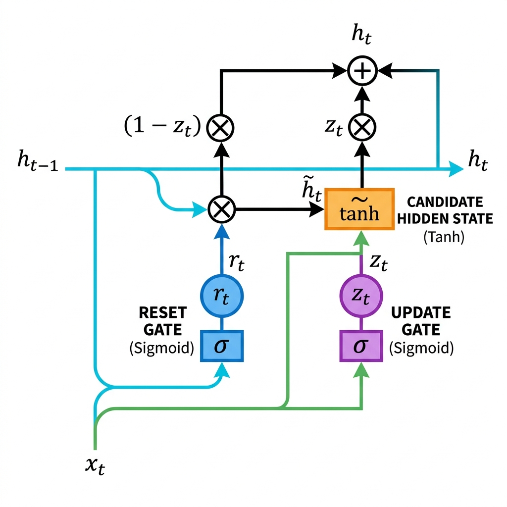

# 05. Gated Recurrent Unit (GRU): The Complete Beginner's Guide

While **Long Short-Term Memory (LSTM)** networks solved the vanishing gradient problem, they introduced significant computational complexity—requiring 3 separate gates and 2 memory tracks.

To create a faster, lighter, and more streamlined alternative, Kyunghyun Cho et al. (2014) introduced the **Gated Recurrent Unit (GRU)**. This note provides a complete, beginner-friendly guide to GRUs, including circuit diagrams, mathematical formulas, symbol breakdown tables, and a step-by-step worked example.

---

## 1. Why GRU? (LSTM vs. GRU Analogy)

### The Simplification
If LSTM is like carrying a **Smart Notebook** alongside your mental memory, a **GRU** is like carrying a **Compact Whiteboard**:

* **No Separate Cell State:** GRU merges the Cell State ($C_t$) and Hidden State ($h_t$) into a **single Hidden State ($h_t$)**.
* **Fewer Gates (2 instead of 3):** GRU eliminates the separate Forget and Input gates, replacing them with a single **Update Gate ($z_t$)** alongside a **Reset Gate ($r_t$)**.

```
LSTM Architecture: 2 Tracks (Cell State C_t + Hidden State h_t) + 3 Gates (Forget, Input, Output)
GRU Architecture:  1 Track  (Hidden State h_t only)           + 2 Gates (Reset, Update)
```

---

## 2. The Core Architecture: 1 Track and 2 Gates

A GRU cell manages a single memory state $h_t$ using two control gates:

```
┌───────────────────────────────┬────────────────────────────────────────────────────────┐
│ Gate                          │ Purpose & Function                                     │
├───────────────────────────────┼────────────────────────────────────────────────────────┤
│ 1. Reset Gate (r_t)           │ Decides how much of the PAST memory (h_{t-1}) to      │
│                               │ FORGET/IGNORE when computing the new candidate state.  │
│ 2. Update Gate (z_t)          │ Decides how much of the OLD memory (h_{t-1}) to retain │
│                               │ vs. how much of the NEW candidate (h̃_t) to write.      │
└───────────────────────────────┴────────────────────────────────────────────────────────┘
```

Both gates use a **Sigmoid ($\sigma$)** activation function, outputting values strictly between **0 and 1**:
* **0** = "Block completely / Ignore"
* **1** = "Pass completely / Keep"

---

## 3. Complete Circuit Diagram of a GRU Cell

Here is the high-resolution architectural diagram of a single GRU cell processing time step $t$:



---

### Internal ASCII Circuit Flow:

Here is the corresponding internal circuit layout showing exact signal routing and gate locations:

```
================================================================================================------------------------
                                       FULLY LABELED GRU CELL CIRCUIT DIAGRAM
================================================================================================------------------------

  Previous Hidden State h_{t-1} ──────────────────┬─────────────────────────────( × ) ───────────────────────┐
                                                  │                              ▲ (Reset Factor r_t)        │
                                                  │                              │                           │
                                         ┌────────┴────────┐            ┌────────┴────────┐                  │
                                         │   RESET GATE    │            │   UPDATE GATE   │                  │
                                         │     [ σ ]       │            │     [ σ ]       │                  │
                                         └────────▲────────┘            └────────▲────────┘                  │
                                                  │                              │                           │
                                                  │                     (z_t)    │                           │
                                                  │             ┌────────────────┼──────────────┐            │
                                                  │             │                │              │            │
                                                  │             ▼                │              │            │
                                                  │          (1 - z_t)           │              │            │
                                                  │             │                │              │            │
                                                  │             ▼                │              │            ▼
  Input x_t ──────────────────────────────────────┴─────────────┼────────────────┴──────────────┼───► [ CANDIDATE tanh ]
                                                                │                               │            │
                                                                ▼                               ▼            │ (Candidate h̃_t)
                                                              ( × ) ──────────────────────────► ( + ) ◄──────┘
                                                                                                 │
                                                                                                 ▼
                                                                                   New Hidden State h_t

================================================================================================------------------------
  LEGEND:
  [ σ ]    = Sigmoid Layer (Output range [0, 1])           ( × ) = Element-wise Multiplication
  [tanh]   = Tanh Layer    (Output range [-1, +1])          ( + ) = Element-wise Addition
================================================================================================------------------------
```

---

### 🎯 Gate Identification & Component Map (Where Each Gate Lives in the Circuit):

| Gate / Component | Location in Circuit Diagram | Exact Connection & Function in Circuit |
| :--- | :--- | :--- |
| **1. RESET GATE ($r_t$)** | **1st `[ σ ]` box on the LEFT** | Multiplies previous hidden state $h_{t-1}$ before entering the candidate $\tanh$ block ($r_t \odot h_{t-1}$). |
| **2. UPDATE GATE ($z_t$)** | **2nd `[ σ ]` box in MIDDLE** | Controls the final blend: $(1 - z_t)$ scales old memory $h_{t-1}$, while $z_t$ scales new candidate $\tilde{h}_t$. |
| **3. CANDIDATE STATE ($\tilde{h}_t$)** | **`[ tanh ]` box on the RIGHT** | Computes potential new memory using current input $x_t$ and reset-filtered past memory ($r_t \odot h_{t-1}$). |
| **4. HIDDEN STATE HIGHWAY ($h_t$)** | **Single output line** | $h_t = (1 - z_t) \odot h_{t-1} + z_t \odot \tilde{h}_t$ |

---

## 4. The 4 Steps of GRU: Equations & Symbol Breakdown

Let's break down the 4 mathematical steps executing inside a GRU cell.

---

### Step 1: The Reset Gate ($r_t$) — Deciding What Past Memory to Discard

The Reset Gate determines how much of the previous hidden state $h_{t-1}$ should be remembered when calculating the new candidate memory.

#### Equation:
$$r_t = \sigma\left( W_r \cdot [h_{t-1}, x_t] + b_r \right)$$

#### Symbol Breakdown Table:

| Symbol | Meaning | Range / Dimension |
| :--- | :--- | :--- |
| **$r_t$** | Reset gate vector (fraction of past memory to retain for candidate) | $[0.0, 1.0]$ |
| **$\sigma$** | Sigmoid activation function $\frac{1}{1 + e^{-z}}$ | Squashes to $(0, 1)$ |
| **$W_r$** | Weight matrix for the Reset Gate | $[d_h, (d_h + d_x)]$ |
| **$h_{t-1}$** | Previous hidden state memory vector | $[d_h, 1]$ |
| **$x_t$** | Current input vector at time step $t$ | $[d_x, 1]$ |
| **$[h_{t-1}, x_t]$** | Concatenation of previous hidden state and current input | $[(d_h + d_x), 1]$ |
| **$b_r$** | Bias vector for the Reset Gate | $[d_h, 1]$ |

* **Intuition:** If $r_t = 0$, the cell completely ignores all past memory $h_{t-1}$ and acts like it's reading the first word of a sequence!

---

### Step 2: The Update Gate ($z_t$) — Deciding Memory Balance

The Update Gate controls how much of the previous hidden state $h_{t-1}$ to carry forward versus how much of the new candidate memory $\tilde{h}_t$ to write.

#### Equation:
$$z_t = \sigma\left( W_z \cdot [h_{t-1}, x_t] + b_z \right)$$

#### Symbol Breakdown Table:

| Symbol | Meaning | Range / Dimension |
| :--- | :--- | :--- |
| **$z_t$** | Update gate vector (balancing factor between old & new memory) | $[0.0, 1.0]$ |
| **$W_z$** | Weight matrix for the Update Gate | $[d_h, (d_h + d_x)]$ |
| **$b_z$** | Bias vector for the Update Gate | $[d_h, 1]$ |

* **Intuition:** $z_t$ acts simultaneously as both Input and Forget gates! 
  * If $z_t \approx 1$, the model copies the new candidate $\tilde{h}_t$.
  * If $z_t \approx 0$, the model preserves old memory $h_{t-1}$ unchanged.

---

### Step 3: Candidate Hidden State ($\tilde{h}_t$) — Calculating Potential New Memory

The Candidate Hidden State computes a new memory proposal. Notice that the previous memory $h_{t-1}$ is first multiplied by the Reset Gate $r_t$:

#### Equation:
$$\tilde{h}_t = \tanh\left( W_h \cdot [r_t \odot h_{t-1}, x_t] + b_h \right)$$

#### Symbol Breakdown Table:

| Symbol | Meaning | Range / Dimension |
| :--- | :--- | :--- |
| **$\tilde{h}_t$** | Candidate hidden state vector (proposed new memory) | $[-1.0, +1.0]$ |
| **$r_t \odot h_{t-1}$** | Past hidden state filtered by the Reset Gate | Scaled Memory |
| **$W_h$** | Weight matrix for Candidate Hidden State | $[d_h, (d_h + d_x)]$ |
| **$b_h$** | Bias vector for Candidate Hidden State | $[d_h, 1]$ |
| **$\tanh$** | Hyperbolic Tangent activation function | Squashes to $(-1, +1)$ |

---

### Step 4: Final Hidden State Update ($h_t$) — Linear Interpolation

Finally, the new Hidden State $h_t$ is computed using a **linear interpolation** between the old hidden state $h_{t-1}$ and the candidate state $\tilde{h}_t$, governed by the Update Gate $z_t$:

#### Equation:
$$h_t = \left( 1 - z_t \right) \odot h_{t-1} + z_t \odot \tilde{h}_t$$

#### Symbol Breakdown Table:

| Symbol | Meaning | Range / Dimension |
| :--- | :--- | :--- |
| **$h_t$** | NEW updated Hidden State vector (Output at time $t$) | $[-1.0, +1.0]$ |
| **$(1 - z_t) \odot h_{t-1}$** | Fraction of OLD memory retained | Scaled Past Memory |
| **$z_t \odot \tilde{h}_t$** | Fraction of NEW candidate memory added | Scaled New Memory |

---

## 5. Step-by-Step Worked Example

### Text Tracking Scenario:
Consider the paragraph:
> **"Alice is a doctor. Bob is a chef. She lives in Paris."**

1. **Step $t=1$ ($x_1 =$ "Alice"):**
   * Update Gate ($z_1 \approx 1$): Writes "Alice" (Female subject) into Hidden State $h_1$.
2. **Step $t=5$ ($x_5 =$ "Bob"):**
   * Reset Gate ($r_5 \approx 0$): Resets past female subject memory when processing "Bob".
   * Update Gate ($z_5 \approx 1$): Updates Hidden State $h_5$ with "Bob" (Male subject).
3. **Step $t=9$ ($x_9 =$ "She"):**
   * Reset Gate ($r_9$): Triggers memory lookup matching "She" (Female) with stored subject "Alice".
   * Output: Correctly predicts context for "Alice"!

---

### Numerical Vector Walkthrough

Suppose:
* Old Hidden State $h_{t-1} = 0.6$
* Input $x_t = 1.0$

1. **Compute Reset Gate ($r_t$):**
   $$r_t = \sigma(W_r \cdot [0.6, 1.0] + b_r) = \sigma(1.2) = \mathbf{0.768}$$
2. **Compute Update Gate ($z_t$):**
   $$z_t = \sigma(W_z \cdot [0.6, 1.0] + b_z) = \sigma(0.4) = \mathbf{0.598}$$
3. **Compute Candidate Hidden State ($\tilde{h}_t$):**
   $$\text{Filtered Memory } r_t \times h_{t-1} = 0.768 \times 0.6 = 0.4608$$
   $$\tilde{h}_t = \tanh(W_h \cdot [0.4608, 1.0] + b_h) = \tanh(0.85) = \mathbf{0.691}$$
4. **Compute Final Hidden State ($h_t$):**
   $$h_t = (1 - 0.598) \times 0.6 + (0.598 \times 0.691) = (0.402 \times 0.6) + (0.4132) = 0.2412 + 0.4132 = \mathbf{0.6544}$$

---

## 6. Detailed Comparison: Standard RNN vs. LSTM vs. GRU

| Feature | Standard RNN | LSTM | GRU |
| :--- | :--- | :--- | :--- |
| **Memory Tracks** | 1 Track ($h_t$) | **2 Tracks** ($C_t$ and $h_t$) | **1 Track** ($h_t$ only) |
| **Number of Gates** | 0 Gates | **3 Gates** (Forget, Input, Output) | **2 Gates** (Reset, Update) |
| **Parameters per Cell** | $1 \times \text{weights}$ | $4 \times \text{weights}$ | **$3 \times \text{weights}$ ($25\%$ fewer params)** |
| **Training Speed** | Fast | Slower (More matrix ops) | **Faster than LSTM** |
| **Vanishing Gradient** | Severe issue | Solved | **Solved** |
| **Best Used For** | Short sequences | Long, complex sequences | **Small/medium datasets, fast training** |
