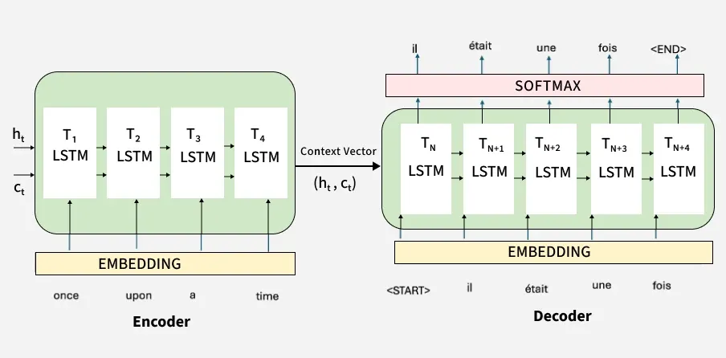

# 01. Introduction to the Encoder-Decoder Architecture

Traditional neural networks and standard Recurrent Neural Networks (RNNs) assume that input and output sequences have fixed or equal lengths ($T_x = T_y$). However, many of the most important real-world sequential tasks—such as **Machine Translation**, **Text Summarization**, and **Conversational Chatbots**—require mapping an input sequence of length $T_x$ to an output sequence of a completely different length $T_y$.

To solve this challenge, Ilya Sutskever et al. (2014) and Kyunghyun Cho et al. (2014) invented the **Encoder-Decoder (Sequence-to-Sequence / Seq2Seq) Architecture**.

---

## 1. The Human Interpreter Analogy 🗣️

Imagine how a professional human interpreter translates a speech from English to French:

1. **Listening / Encoding Phase:** The interpreter listens to the *complete* English sentence without interrupting. They understand the overall meaning and compress that understanding into a single mental thought/summary.
2. **Speaking / Decoding Phase:** Using that mental summary, the interpreter speaks the French translation word-by-word from start to finish until the sentence is complete.

```
Source Sentence (English) ──► [ ENCODER ] ──► Mental Thought (Context Vector c) ──► [ DECODER ] ──► Target Sentence (French)
```

---

## 2. Why Standard RNNs Cannot Solve Variable-Length Seq2Seq Directly

Standard RNNs fail on sequence-to-sequence tasks due to two fundamental constraints:

1. **Mismatched Sequence Lengths ($T_x \neq T_y$):** In language translation, the input sentence length and output sentence length are almost never equal:
   * *English (4 words):* **"Thank you very much"**
   * *French (2 words):* **"Merci beaucoup"**
   * *German (3 words):* **"Vielen Dank"**
   * A standard synchronous RNN expects 1 output token for every 1 input token, which breaks down completely when translating between languages!

2. **Grammar & Word Reordering:** Word order varies significantly across languages.
   * *English:* *"The **green** apple"* (Adjective precedes Noun).
   * *French:* *"La pomme **verte**"* (Adjective follows Noun).
   * A synchronous 1-to-1 RNN cannot handle non-linear alignment where word order shifts.

---

## 3. Core Components of the Encoder-Decoder Architecture

The architecture splits the sequential task into two specialized sub-networks bridged by a central representation:

```
┌───────────────────────────────┬────────────────────────────────────────────────────────────────────────┐
│ Component                     │ Role & Function in the Architecture                                    │
├───────────────────────────────┼────────────────────────────────────────────────────────────────────────┤
│ 1. The Encoder Network        │ An RNN/LSTM/GRU that reads the input sequence x_1, ..., x_{T_x}        │
│                               │ step-by-step and compresses it into a hidden state representation.     │
│                               │ All intermediate outputs are discarded; only the final hidden state    │
│                               │ is preserved.                                                          │
│                               │                                                                        │
│ 2. The Context Vector (c)     │ The final hidden state of the encoder: c = h_{T_x}.                    │
│                               │ It acts as a fixed-size numerical "information bottleneck" that        │
│                               │ summarizes the entire source sentence into a single vector.            │
│                               │                                                                        │
│ 3. The Decoder Network        │ An RNN/LSTM/GRU initialized with the Context Vector (s_0 = c).         │
│                               │ Generates the target sequence y_1, ..., y_{T_y} one word at a time     │
│                               │ in an auto-regressive manner.                                          │
│                               │                                                                        │
│ 4. Special Control Tokens     │ • <SOS> / <BOS>: "Start of Sequence" token to prompt the decoder.      │
│                               │ • <EOS>: "End of Sequence" token telling the decoder when to stop.     │
│                               │ • <PAD>: Padding token used to equalize batch lengths in mini-batches. │
│                               │ • <UNK>: Replaces rare or out-of-vocabulary unknown words.             │
└───────────────────────────────┴────────────────────────────────────────────────────────────────────────┘
```

---

## 4. Architecture Diagram



---

## Summary Key Points

* **Seq2Seq Core Idea:** Decouples input sequence processing from output sequence generation.
* **Encoder Role:** Reads input sequence of length $T_x$ and compresses it into a single **Context Vector $c = h_{T_x}$**.
* **Decoder Role:** Unrolls from initial state $s_0 = c$ to generate output sequence of length $T_y$ token-by-token until `<EOS>` is predicted.
* **Control Tokens:** Uses `<SOS>` to begin decoding and `<EOS>` to terminate generation.
